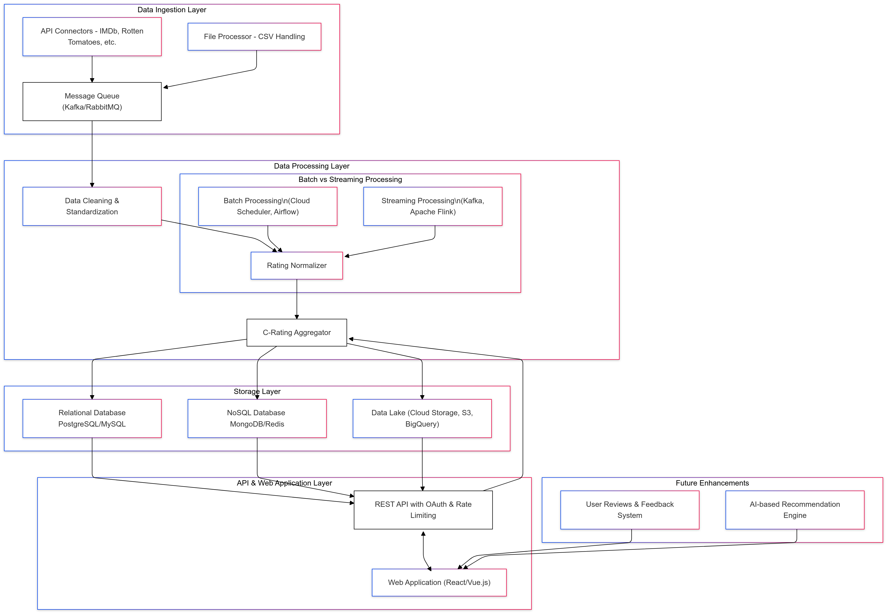

# 🎬 C-Movie System Architecture Diagram  

## 1️⃣ Overview  
C-Movie is a **movie rating aggregation platform** that collects and processes movie ratings from multiple sources (e.g., IMDb, Rotten Tomatoes).  
It standardizes these ratings and presents a unified **C-Rating** based on predefined criteria.  

The platform consists of **four main layers**:  
- 📥 **Data Ingestion**  
- 🔄 **Data Processing & Normalization**  
- 💾 **Storage**  
- 🌍 **API & Web Application**  

---

## 2️⃣ UML Architecture  

### 📌 **System Architecture Diagram**  

## 3. Data Flow Description
1. **Data Collection** → API Connectors and File Processor fetch movie data.
2. **Data Processing** → Kafka processes data asynchronously.
3. **Data Cleaning & Normalization** → Ensures consistency in movie data.
4. **Rating Computation** → C-Rating Aggregator calculates the weighted ratings.
5. **Data Storage** → Relational and NoSQL databases store processed data.
6. **Data Retrieval** → API serves the processed data to users.

## 4. Batch vs. Streaming Processing
- **Batch Processing (Cloud Scheduler, Airflow)**: Processes large datasets periodically.
- **Streaming Processing (Kafka, Apache Flink)**: Real-time processing of movie ratings.

## 5. Security & API Management
- **OAuth Authentication** and **Rate Limiting**.
- **Data Encryption (HTTPS & at rest)**.
- **Caching with Redis** for faster responses.

## 6. Future Considerations & Enhancements
- **User Reviews & Feedback System**.
- **AI-based Recommendation Engine** for personalized movie suggestions.
- **Advanced Analytics using BigQuery**.
- **Edge Caching for performance improvements**.

## 7. Documentation  
📌 **For detailed documentation, visit the following sections:**  

- 📥 [Data Ingestion Layer](docs/01-data-ingestion.md)  
- 🔄 [Data Processing & Normalization Layer](docs/02-data-processing.md)  
- 💾 [Storage Layer](docs/03-storage.md)  
- 🌍 [API & Web Application Layer](docs/04-api-web-application.md)  
- 🚀 [Future Enhancements](docs/future-enhancements.md)  

## 8. Conclusion
The proposed architecture ensures **efficient aggregation, standardization, and retrieval** of movie ratings across multiple sources. This design supports **scalability, maintainability, and future AI enhancements**.
